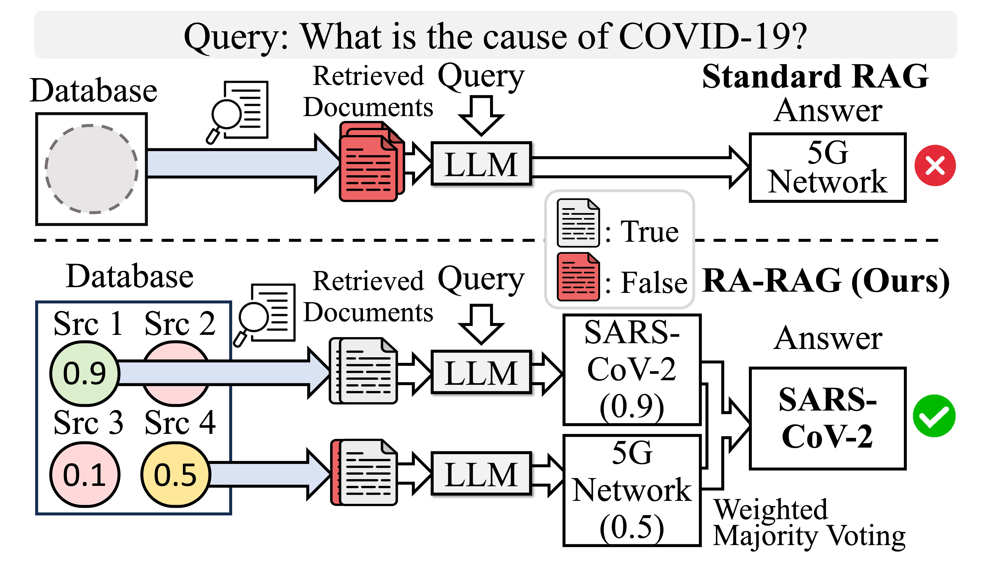

# RA-RAG: Retrieval-Augmented Generation with Estimation of Source Reliability (EMNLP 2025, main)



To address inherent limitations of standard RAG systems, which can inadvertently retrieve misinformation, we propose a multi-source framework, RA-RAG, that estimates source reliability and incorporates it into both the retrieval and answer generation processes. This framework addresses a critical gap in RAG systems, where the importance of source reliability in mitigating misinformation has largely been overlooked.

## Installation

Set up the environment and install dependencies:

```bash
pip install -r requirements.txt
python -m spacy download en_core_web_sm
```

## Usage

### Running RA-RAG

The repository provides shell scripts for data generation and running the RA-RAG framework:

- **`main_beta_prior.sh`**: Data generation and execution with beta prior sampling
- **`main_adv_hammer_prior.sh`**: Data generation and execution with adversary hammer prior sampling

Execute the scripts directly:

```bash
bash main_beta_prior.sh
# or
bash main_adv_hammer_prior.sh
```

## Citation

If you find RA-RAG useful or use RA-RAG in your research, please cite it in your publications.

```bibtex
@inproceedings{hwang2025retrieval,
  title={Retrieval-augmented generation with estimation of source reliability},
  author={Hwang, Jeongyeon and Park, Junyoung and Park, Hyejin and Kim, Dongwoo and Park, Sangdon and Ok, Jungseul},
  booktitle={Proceedings of the 2025 Conference on Empirical Methods in Natural Language Processing},
  pages={34267--34291},
  year={2025}
}
```

## License

This project is licensed under the [MIT License](LICENSE).
The code in `Alignscore/` is adapted from [AlignScore](https://github.com/yuh-zha/AlignScore), which is also released under the MIT License.
